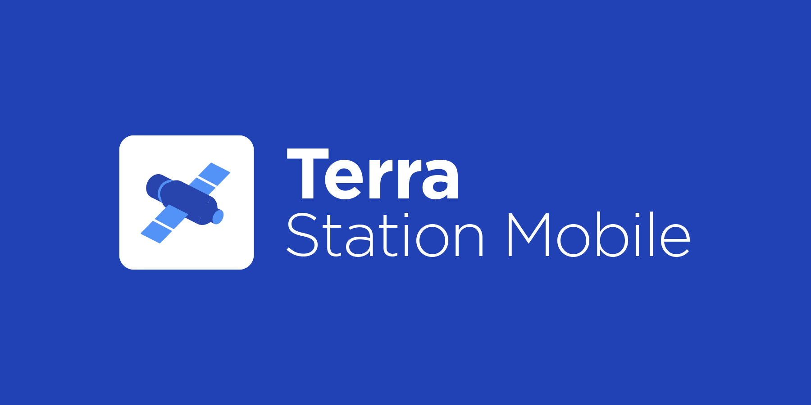

# Deployment 

Use this guide for deploying the application: https://developer.apple.com/documentation/xcode/distributing-your-app-for-beta-testing-and-releases

# Running Locally

Make sure to use nvm to set the node version to 14

```
nvm use 14
```

Make sure to set up your local comp's android studio to run react native:
https://reactnative.dev/docs/environment-setup

Then check below for more information on running locally

## Troubleshooting

If you get a error message with the JAVA_HOME being invalid check where the java sdk is located by `cd` into the folders, typically on macs it is

https://stackoverflow.com/questions/22842743/how-to-set-java-home-environment-variable-on-mac-os-x-10-9

```
export JAVA_HOME=`/usr/libexec/java_home`
```

Add the above to the .zshrc or .bash_profile (if you use bash)

# Terra Station Mobile App



**Terra Station Mobile** is an application to interact with [Terra Core](https://github.com/terra-money/core).

Terra Station Mobile allows users to:

- Create wallets and send tokens
- Get involved with staking, by browsing through validator information and delegating Luna tokens
- Atomically swap currencies on the Terra network at the effective on-chain exchange rate
- QRCode support for easy interactions when sending assets and recovering wallets

## App Scheme

### Send ( terrastation://send/?payload=${base64 json} )
```
// payload json
{
  address?: string // terra, ethereum, bsc
  amount?: string
  token: string // native token : denom, cw20 : contract address
  memo?: string
}
```

### WalletConnect - Connect ( terrastation://walletconnect_connect/?payload=${base64 json} )
```
// payload json
{
  uri : string // wallet connect bridge uri
}
```

### WalletConnect - Confirm ( terrastation://walletconnect_confirm/?payload=${base64 json} )
```
// tx: CreateTxOptions in terra.js
const params = {
  msgs: tx.msgs.map((msg) => msg.toJSON()),
  fee: tx.fee?.toJSON(),
  memo: tx.memo,
  gasPrices: tx.gasPrices?.toString(),
  gasAdjustment: tx.gasAdjustment?.toString(),
  account_number: tx.account_number,
  sequence: tx.sequence,
  feeDenoms: tx.feeDenoms,
}

// payload json
{
  id : string // unique value. ex) Date.now()
  handshakeTopic : string // WalletConnector handshakeTopic
  params: object // serialized CreateTxOptions
}
```

## Prerequisites

### Android

- Android Studio 4.1.1 or later

### iOS

- XCode 12.5.1 or later
- Cocoapods 1.10.1 or later

### React Native

- Node.js v14.15.3 or later

## Instructions

1. Install submodule

```bash
$ git submodule init
$ git submodule update
```

2. Install dependencies

```bash
$ npm install
```

3. Install pod (iOS)

```bash
$ cd ios && pod install && cd ..
```

4. Launch app

```bash
$ npm run [ios|android]
```

## License

This software is licensed under the Apache 2.0 license. Read more about it [here](./LICENSE).

© 2021 Terra Station Mobile
